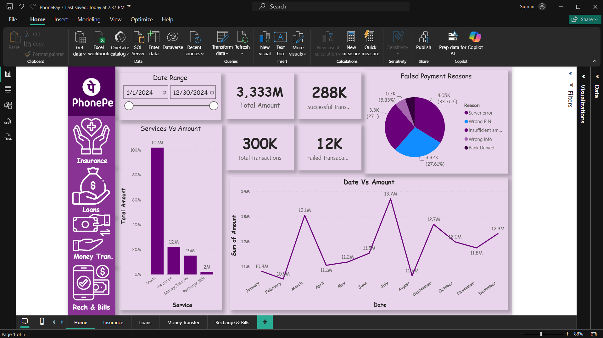
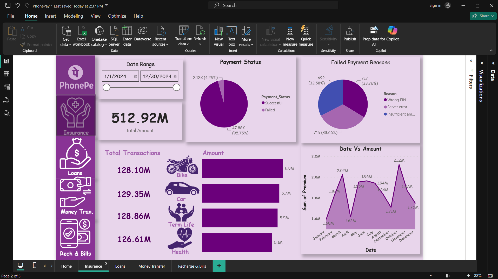
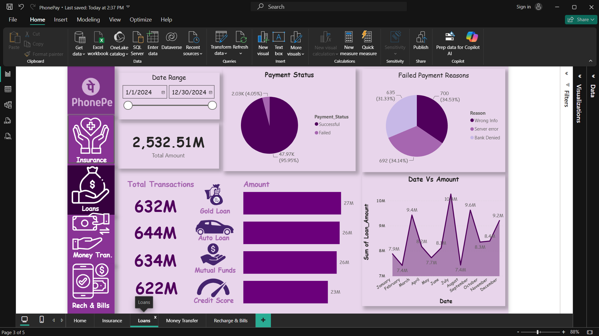
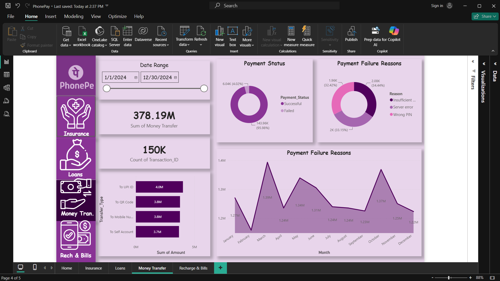
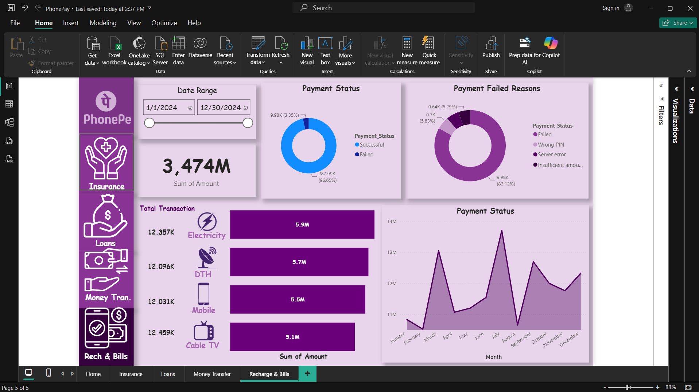

# 📊 PhonePe Transaction Analysis Dashboard

## 📌 Project Overview

This project is an interactive Power BI dashboard built using a PhonePe transaction dataset. It provides insights into transaction amounts, payment status, failed payment reasons, and service-wise performance through interactive visualizations.

The dashboard helps analyze user transaction behavior and identify business opportunities using data-driven insights.

---

## 🎯 Objectives

- Analyze total transaction amount and volume
- Track successful and failed transactions
- Identify major payment failure reasons
- Compare transaction performance across different services
- Analyze monthly transaction trends
- Build an interactive dashboard using Power BI

---

# 🛠️ Tools & Technologies

- Power BI Desktop
- Power Query
- DAX
- Microsoft Excel
- Data Visualization
- Git & GitHub

---

# 📂 Project Structure

```
PhonePe-PowerBI-Dashboard
│
├── PhonePe_Dashboard.pbix
├── PhonePe_Transactions.xlsx
├── README.md
├── LICENSE
└── Screenshots
    ├── Home.png
    ├── Insurance.png
    ├── Loans.png
    ├── MoneyTransfer.png
    └── RechargeBills.png
```

---

# 📸 Dashboard Preview

## 🏠 Home Dashboard



---

## 🏥 Insurance Dashboard



---

## 💰 Loans Dashboard



---

## 💸 Money Transfer Dashboard



---

## 📱 Recharge & Bills Dashboard



---

# 📈 Key Business Insights

- Total transaction value exceeded **₹3.33 Billion**
- Approximately **96%** of transactions were successful
- **Loans** generated the highest transaction amount
- **Server Error** was the leading payment failure reason
- Transaction volume peaked during **July**
- Recharge & Bills recorded the lowest transaction amount

---

# 💡 Business Recommendations

- Improve server reliability to reduce failed payments.
- Strengthen authentication guidance to reduce Wrong PIN errors.
- Promote high-performing services such as Loans.
- Investigate seasonal transaction peaks for marketing opportunities.
- Improve user guidance for insufficient balance failures.

---

# 🚀 Features

- Interactive navigation buttons
- Dynamic KPI Cards
- Date Range Slicer
- Service-wise Analysis
- Payment Status Analysis
- Monthly Trend Analysis
- Payment Failure Analysis
- Responsive Dashboard Design

---

# 📁 Dataset

The dataset used in this project is included in this repository for learning and portfolio purposes.

---

# 👨‍💻 Author

**Garv Singh**

Aspiring Data Analyst passionate about transforming raw data into meaningful business insights using Power BI, SQL, Excel, and Python.

---

⭐ If you found this project helpful, consider giving it a star!


Linkdin -https://www.linkedin.com/in/garv-singh260/
